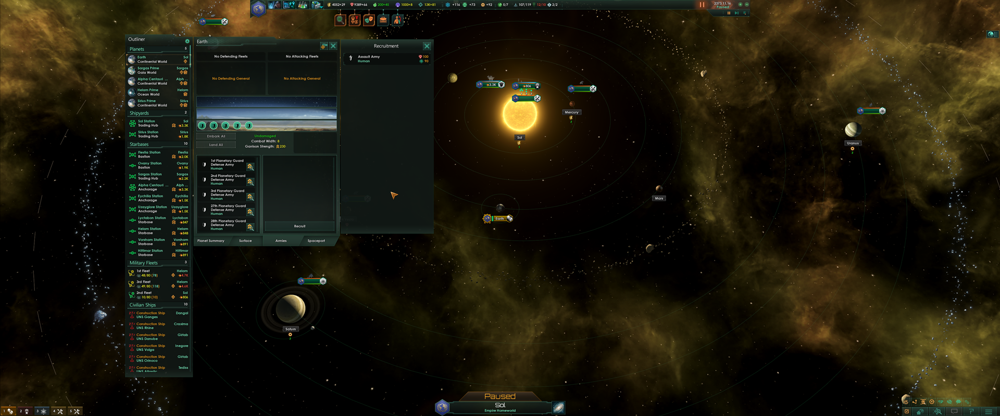
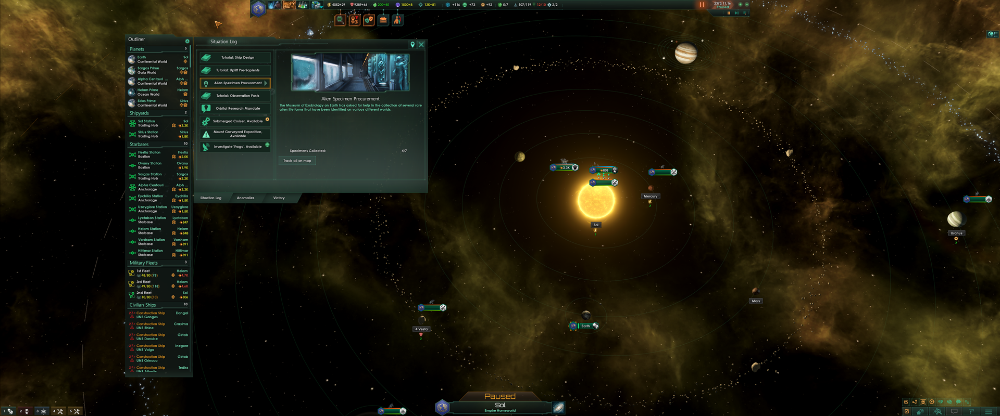

# Stellaris Mods
Custom UI mods for Stellaris by Paradox

## Custom UI

### Introduction
Our Custom UI mod was developed with widescreen user experience in mind on a resolution of 3840 by 1600 pixels. It probably does not make sense for Full HD resolution and below. However the intention is to keep it working fine for any screen resolutions. Hopefully it brings some benefits to most widescreen users out there.

### Installation
For Stellaris v2.2 [subscribe here.](https://steamcommunity.com/sharedfiles/filedetails/?id=1584866288)
For Stellaris v2.1 [subscribe here.](https://steamcommunity.com/sharedfiles/filedetails/?id=1574120097)

### Mission
Improve overall comfort and usability especially on widescreen where you otherwise constantly have to turn your head right and left from the Outliner to the Planet View and back again.

### Features
This mod offers one feature common to all resolutions: most windows are now moveable.
Even the Outliner is moveable. The Fleet View being a notable exception as it is effectively hardcoded to the bottom left corner. 

#### Widescreen layout
Special widescreen layout is used for any screen wider than 3440 pixels including 4K screens.
Widescreen layout is putting Outliner on the left and most windows opening on the right of it.  
The top bar is also reduced to 1920 pixels and centred to make it more accessible.

#### Other resolutions
Make most views centered by default.

### Screenshoots

### Known issues
I probably left out some views as this is still an early version needing more testing.
Please feel free to report issues on GitHub.
* Fleet View was left in the bottom left corner and is not moveable as hardcoded behavior is breaking it positioning.
* 2.2 only: Left navigation bar not showing shortcuts until you move it.
* 2.1 only: Planet View side panels not automatically following main window.

### Further development
Possibly improve default layout for other widescreen resolution much like it was done for 3840x1600.

### Developer tips
* To visualize UI elements in Stellaris use the debug console command `guibounds`.
* `if_resolution` blocks were used for resolution specific modifications.
* For `containerWindowType.moveable` to work `containerWindowType.background` must be present and reachable by pointer events.
* To fix issues where the moveable background is not reachable use `alwaysTransparent = yes` in the covering element block.
* Animations were not usable for moveable windows.
