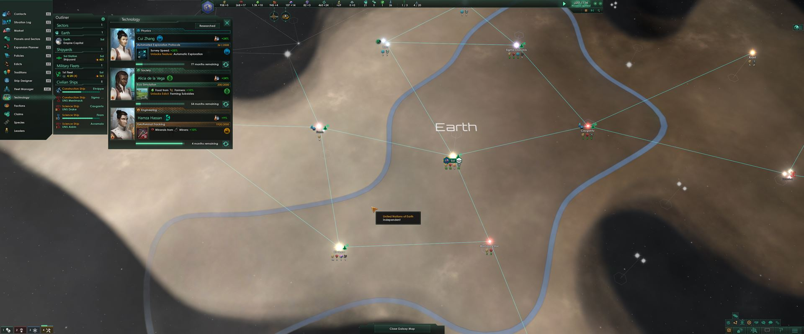

# Stellaris Mods
Custom UI mods for Stellaris by Paradox

## Custom UI
Make most views centered by default and moveable.
Even the Outliner is moveable so you can put it on the left side.

The intention is to keep this mod working fine for any screen resolutions. However it was developed on a widescreen 3840 by 1600 pixels. The main goal is to improve overall comfort and usability especially on widescreen where you constantly have to turn your head left and right from the Outliner to the Planet View for instance.
With this mode you can conveniently position your Outliner on the left between the Fleet View and most other Views opening in the center.

I probably left out some views as this is the first published version.
Please feel free to report issues on GitHub.

Source code on GitHub:
https://github.com/Slion/StellarisMods

Based on:
Stellaris v2.1.3

### Known issues
* Fleet View was left in the bottom left corner and is not moveable as hardcoded behavior is breaking that view position otherwise.
* Planet View side panels not automatically following main window.